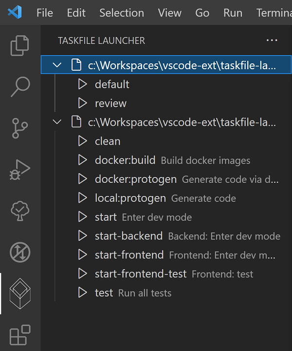

# Taskfile launcher

[](https://marketplace.visualstudio.com/items?itemName=iulian-radu-at.taskfile-launcher)
[](https://marketplace.visualstudio.com/items?itemName=iulian-radu-at.taskfile-launcher)
[](https://marketplace.visualstudio.com/items?itemName=iulian-radu-at.taskfile-launcher)
<a href="http://opensource.org/licenses/GPL-3.0" target="_blank" rel="noreferrer noopener"></a>

Automatically find all tasks defined in Taskfile.yml like files.
For more information about Taskfile.yml files visit [taskfile.dev](https://taskfile.dev/).

## Features

- Automatically find all defined tasks in Taskfile.yml like files
- The tasks can be started in a terminal directly from Visual Studio Code interface
  - The prerequisite is to have the command `task` already installed and available in PATH

## Usage

This extension has its own panel. The symbol of this panel is a similar with the official symbol of [task](https://taskfile.dev/).

Open the panel and the extension will start the scan for the tasks.
If you made changes to the taskfiles, the extension will not detect these to avoid unnecessary scans.
You can force a rescan using the reload button found at top right of the panel.

If there are no taskfiles or tasks in the taskfiles, the panel will display this information.

### Included files

By default, only Taskfile.yml files found in the folders of a workspace are found and scanned.

If you want to include other files you can define them in the settings of this extension.

Or you can add a section called taskfileLauncher in package.json

```json
# package.json
{
  "taskfileLauncher": [ "**/Taskfile.yml" ]
}
```

Or create a file called .taskfileLauncher.json in the same folder with package.json

```json
# .taskfileLauncher.json
[ "**/Taskfile.yml" ]
```

If both are used then all globs will be used.

## Used terminal

The task will be started with the default terminal. This is defined in the Visual Studio Code setting "Terminal > Integrated > Default Profile: <your OS>". Take care that this setting will be ignored if there is defined any shell via the setting "terminal.integrated.shell.<your OS>" or any shell arguments via "terminal.integrated.shellArgs.<your OS>".

### Screenshot

Bellow you can see an example of found tasks as are they displayed by this extension:



## Requirements

There are no special requirements.

## Extension Settings

- taskfileLauncher.debug:

  - Taskfile launcher: log all actions in an output window
  - default false

- taskfileLauncher.defaultResultExpanded:

  - Taskfile launcher: show all found results initially expanded (otherwise collapsed)
  - default false

- taskfileLauncher.taskfileNames:

  - Taskfile launcher: list the name of all files containing tasks (as a glob)
  - default Taskfile.yml

- taskfileLauncher.shellPath:

  - Taskfile launcher: path to a shell executable to be used in the terminal
  - default terminal configured in Visual Studio Code

- taskfileLauncher.shellArgs:

  - Taskfile launcher: args for the shell executable defined in taskfileLauncher.shellPath (each argument is separated by a space)
  - default none

## Known Issues

None.

## Change Log

See Change Log [here](CHANGELOG.md)

## Issues

Submit an [issue](https://github.com/iulian-radu-at/taskfile-launcher/issues) if you find any bug or have any request.

## Contribution

Fork the [repo](https://github.com/iulian-radu-at/taskfile-launcher) and submit pull requests.
